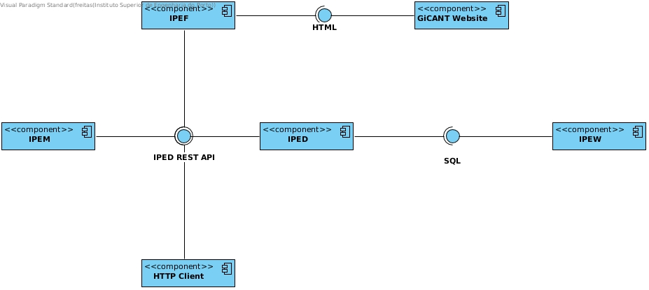

# ipp-ementa 🍕

ipp-ementa aims to ease the access of [IPP](https://www.ipp.pt/) schools canteen menus.

## The problem
Currently IPP offers a service for acessing canteen menus ([GiCANT](https://portal.ipp.pt/GICANT/Info_GiCANT.aspx)), but it's very limited as only IPP schools students and professors/employees can access it, as well as it's only available in various daily moments

## How does ipp-ementa come in handy? 
ipp-ementa offers a delightful cross-platform mobile application which users can use it to view canteen menus without having to authenticate in GiCANT, at any time of the day.

All menus data can be consumed via a REST API, available to everyone with no rate limit

## Components responsibilities

Currently ipp-ementa is structured in four components, being these:

### IPED

IPED, or ipp-ementa distributor for short, is the core of ipp-ementa. It's IPED who has the responsibility to provide canteen menus information, producing a JSON REST API.

### IPEW

IPEW, or ipp-ementa warehouse for short, is ipp-ementa database, storing all information in relational tables. It provides a SQL interface which can only be consumed by IPED for retrieving and storing canteen menus.

### IPES

IPES, or ipp-ementa scraper for short, is the one who fetches canteen menus information by scraping GiCANT website HTML. It consumes IPED REST API in order to add new menus.

### IPEM

IPEM, or ipp-ementa mobile for short, is what most of the users will consume and use. It's a mobile application that consumes IPED REST API, retrieving all needed information which users want to see.

#### Components diagram

