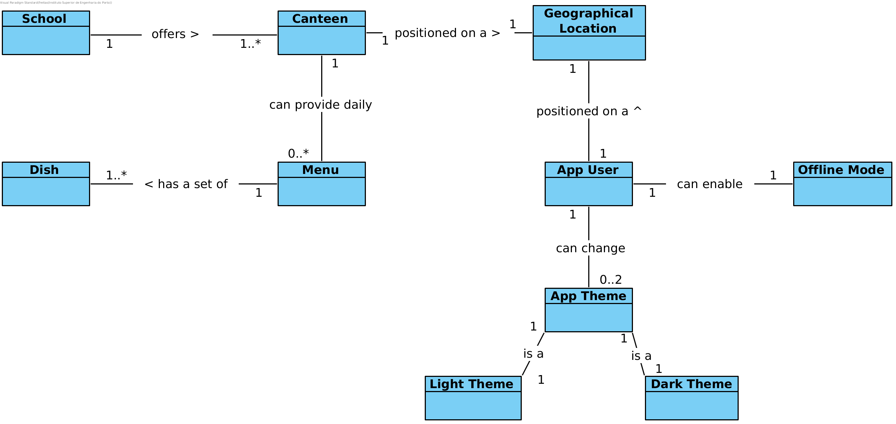

# ipp-ementa 🍕

ipp-ementa aims to ease the access of [IPP](https://www.ipp.pt/) schools canteen menus.

## The problem
Currently IPP offers a service for acessing canteen menus through [Domus](https://domus.ipp.pt) but it's very limited as only IPP schools students and professors/employees can access it, as well as it's only available in various daily moments

## How does ipp-ementa come in handy? 
ipp-ementa offers a delightful cross-platform mobile application which users can use it to view canteen menus without having to authenticate in Domus, at any time of the day.

All menus data can be consumed via a REST API, available to everyone with no rate limit

## Components responsibilities

Currently ipp-ementa is structured in four components, being these:

### IPED

IPED, or ipp-ementa distributor for short, is the core of ipp-ementa. It's IPED who has the responsibility to provide canteen menus information, producing a JSON REST API.

### IPEW

IPEW, or ipp-ementa warehouse for short, is ipp-ementa database, storing all information in relational tables. It provides a SQL interface which can only be consumed by IPED for retrieving and storing canteen menus.

### IPES

IPES, or ipp-ementa scraper for short, is the one who fetches canteen menus information by scraping Domus website HTML. It consumes IPED REST API in order to add new menus.

### IPEM

IPEM, or ipp-ementa mobile for short, is what most of the users will consume and use. It's a mobile application that consumes IPED REST API, retrieving all needed information which users want to see.

### IPEA

IPEA, or ipp-ementa authorization for short is the component that verifies if a client that is producing data on IPED is authorized. It produces a Web API which IPED consumes before updating existing data

#### Components diagram

## Domain Concepts 

ipp-ementa defines the following four main business entities:

### School

Schools are identified by a unique acronym which is followed by the school name (e.g. `ISEP (acronym) - Instituto Superior de Engenharia do Porto (name)`), and offers a set of canteens, needing to offer at least one canteen to be considered as valid

### Canteen

Canteens is where students can eat, being identified by a unique name (e.g `Cantina do ISEP`). They can provide daily menus which are specified for certain daily moments (e.g. Lunch / Dinner). A canteen is positioned on a geographical location

### Menu

Menus provide a set of dishes which students can choose. A menu can provide more than one dish of the same type and has to provide at least one dish

### Dish

Dishes is what students can choose to eat and they are visually identified by their type and description (e.g. `Vegetarian (type) - Peanut Slaw with Soba Noodles (description)`)

### Geographical Location

A geographical point, identified by its latitude and longitude, positioned on Earth

### App User

A user that interacts with the mobile application (IPEM) and is positioned on a geographical location. The user can enable and disable the offline mode setting and change the app theme

### App Theme

Identifies the graphical theme of the mobile application, being available in a light and dark mode

### Offline Mode

Represents a global state of the mobile application, in which menus data is given by a embedded storage

#### Domain model diagram

